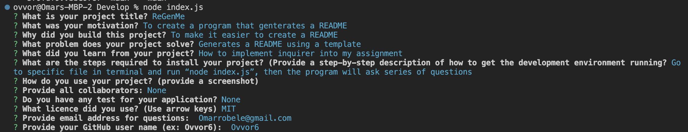
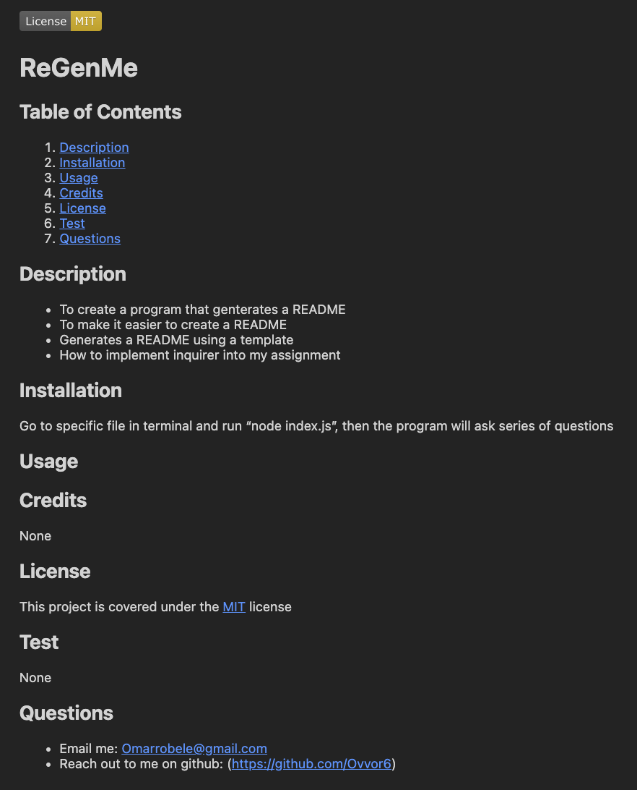

  
  # ReGenMe

  ## Table of Contents
  1. [Description](#description)
  2. [Installation](#installation)
  3. [Usage](#usage)
  4. [Credits](#credits)
  5. [License](#license)
  6. [Test](#test)
  7. [Questions](#questions)

  ## Description
   - To create a program that generates a README
   - To make it easier to create a README
   - Generates a README using a template
   - How to implement inquirer into my assignment

  ## Installation
  Go to specific file in terminal and run “node index.js”, then the program will ask series of questions

  ## Usage
   

  ## Credits 
  None

  ## License
  This project is covered under the [MIT](https://opensource.org/licenses/MIT) license

  ## Test 
  None

  ## Questions
   - Email me: Omarrobele@gmail.com
   - Reach out to me on github: (https://github.com/Ovvor6)
